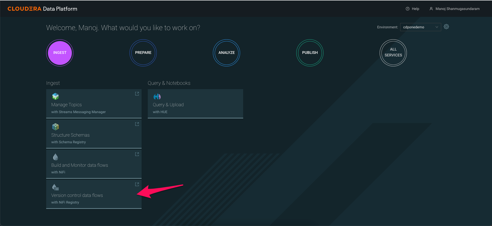
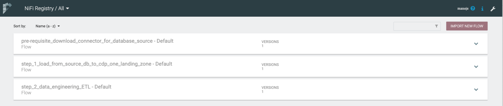
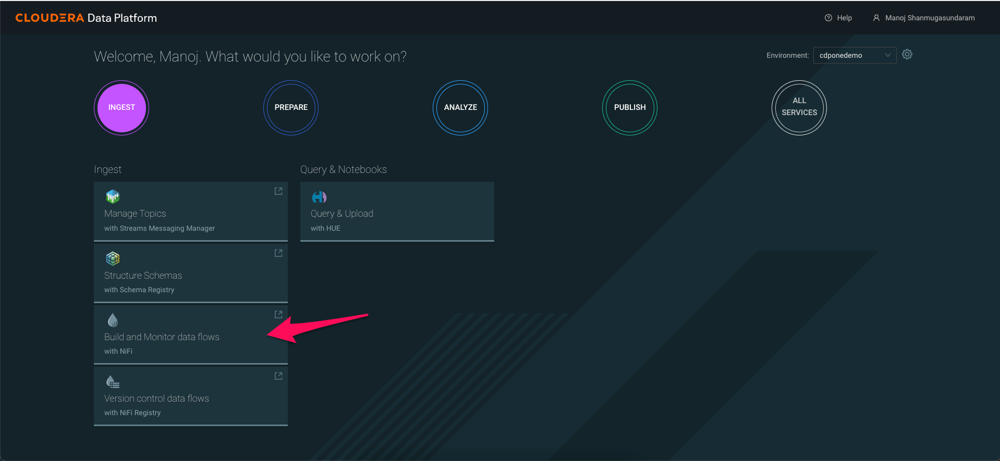
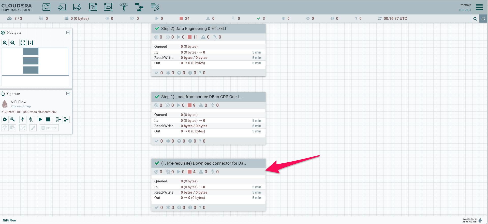
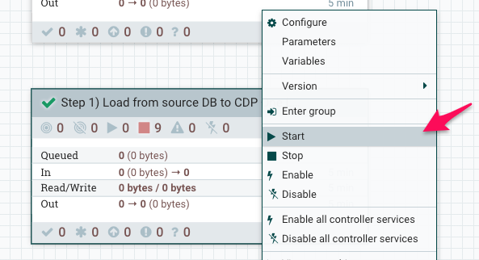

# 01_ingest

In this lab, we will build an end\-to\-end ingestion workflow using Cloudera Data flow.

The primary goal of this workflow is to build an ingestion data pipeline

- The source data exists on a postgresql database. There are 5 datasets that we need to collect and land it into the landing zone of Cloudera Data Platform
    - Flights data
    - Airports data
    - Planes data
    - Airlines data
    - Passenger data
- We connect to the source database and pull all 5 datasets and write the output to ```s3a://<cdp-private-bucket>/landing/airlines```
- The landing data will be written down in a CSV format

## Lab 0: Validate imported flows
1. On your CDP One console, click on ```INGEST``` filter
2. Verify the flows pre\-loaded into your registry
    1. Click on ```Version control data flows```
    2. Three workflows should be preloaded into your registry





3. Now click on ```Build and Monitor data flows```
4. You should see all three processor groups imported for you from the registry



## Lab 1: Data extraction prerequisites (Install driver)

1. We will now run the pre-requisite workflow to download the connectors to pull data from the external database (postgresql)



2. Now, right click on the processor group ```(1. Pre-requisite) Download connector for Database source```
3. Click ```Start```

In the background, the connector required to extract data out of our source system (postgreSQL) will be downloaded

## Lab 2: Data ingestion to landing zone

In this step, you will continue from lab 1 to extract data from the source system (postgresql database) to the CDP One Object store's landing area. We will place the data under CDP One's Object Store.

1. Navigate back to the ```Build and Monitor data flows``` tile on CDP One console.
2. Now, right click on the processor group ```Step 1) Load from source DB to CDP One Landing zone Configuration```
3. Click ```Start```



In this section, we learnt how to extract data from a source system and land the data as files into the CDP Object Store.
