# 01_ingest

In this lab, we will build an end-to-end ingetion workflow using Cloudera Data flow. The primary goal of this workflow is to build a end\-to\-end automated ETL solution using data flow(nifi) to connect to the source external DB, export the table data, keep a copy of the data in AWS s3 bucket, use the csv data to create a dynamic schema, enrich the data and create hive tables for further analysis, visualization and data science. To achieve that goal, this project demonstrates creation of end\-to\-end ETL workflow for ingetion and enrichment of realtime data to allow users to perform analysis, visualize and create machine learning models.

## Part 1:

Configuring the Nifi flow to execute ingestion workflow pre-requisites.

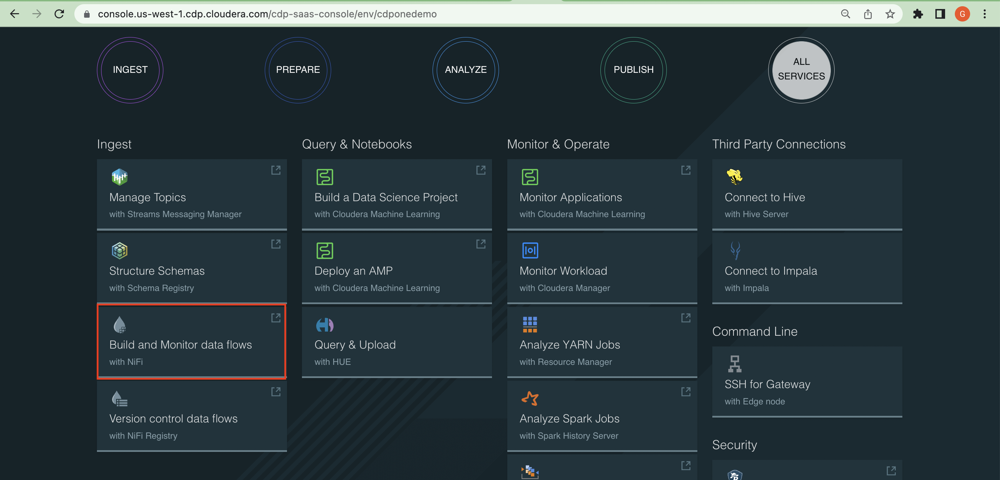

Step 1: Click on Build and Monitor Data flows with Nifi from the CDP One Console for creating the ingestion workflow

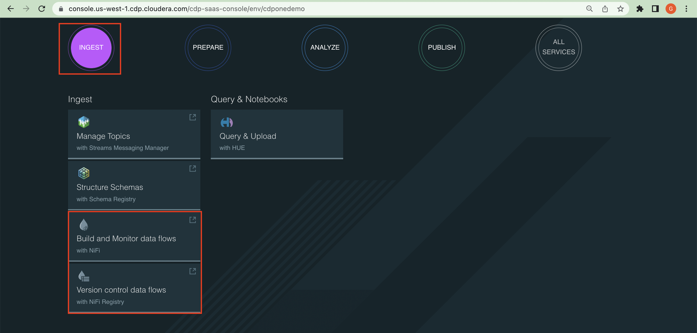

Step 2: From Nifi GUI, click on Add Process Group

Step 3: Then, upload the flow file definition from Nifi Schema Registry
    Note: Select the Airline-Ingestion-Workflow-Pre-requisite flow with the latest version

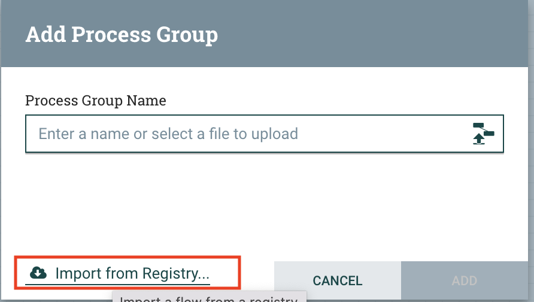

Step 4: Below workflow downloads the JDBC Driver to the Nifi Instances
    Note: But, before starting the flow, we need to modify and enable some parameters and controller services

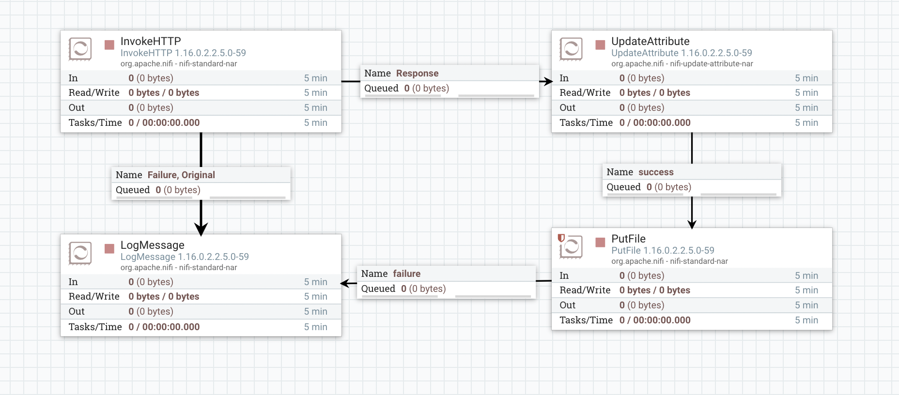

		1. Enable Default NiFi SSL Context Service
		2. Update the driver_location and url_to_download_jdbc variables for downloading the right database driver 
			1. In this scenario flow is using /tmp/jdbc directory and considering postgres is the external database
			2. By using this URL (https://jdbc.postgresql.org/download/postgresql-42.2.26.jre6.jar) to download the postgres jdbc driver

Step 5: Start the workflow and validate the driver in nifi instance by logging to the cdpone Edge node

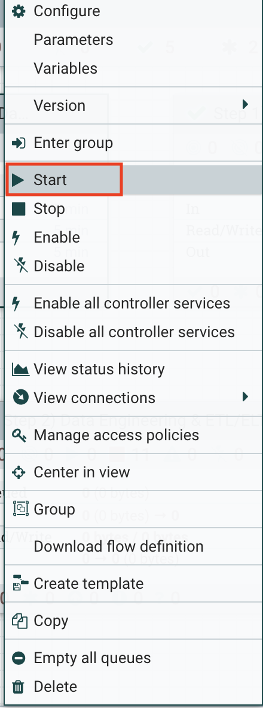

## Part 2:

Configuring the Nifi flow to execute Airline-Ingestion-Workflow-Stage1.

Step 1: From Nifi GUI, click on Add Process Group

Step 2: Then, upload the flow file definition from Nifi Schema Registry
    Note: Select the Airline-Ingestion-Workflow-Stage1 flow with the latest version

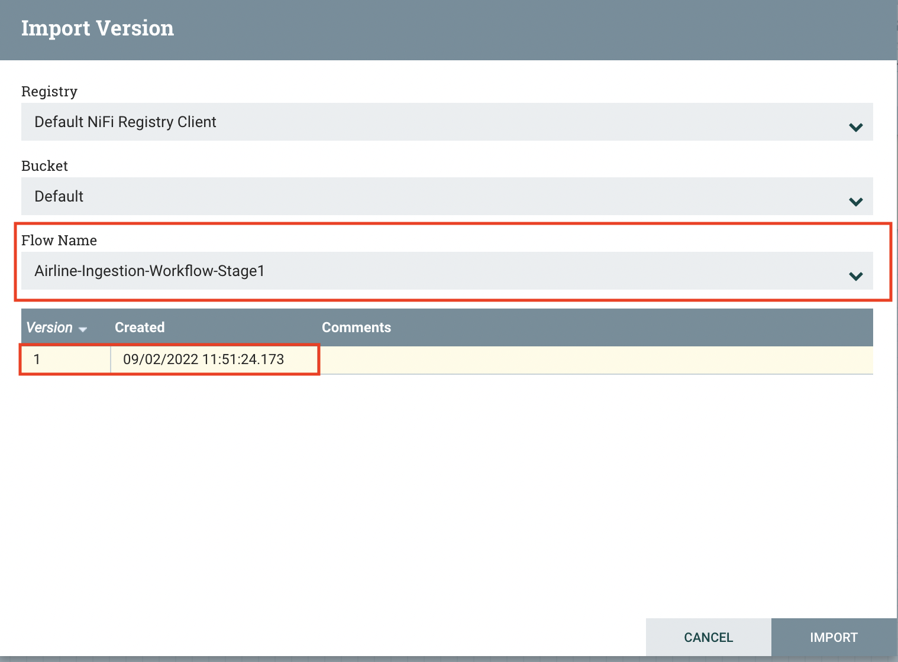    

Step 3: Below workflow connects the source external database and exports the tables in csv format to AWS S3 bucket
    Note: But, before starting the flow, we need to modify and enable some parameters and controller services

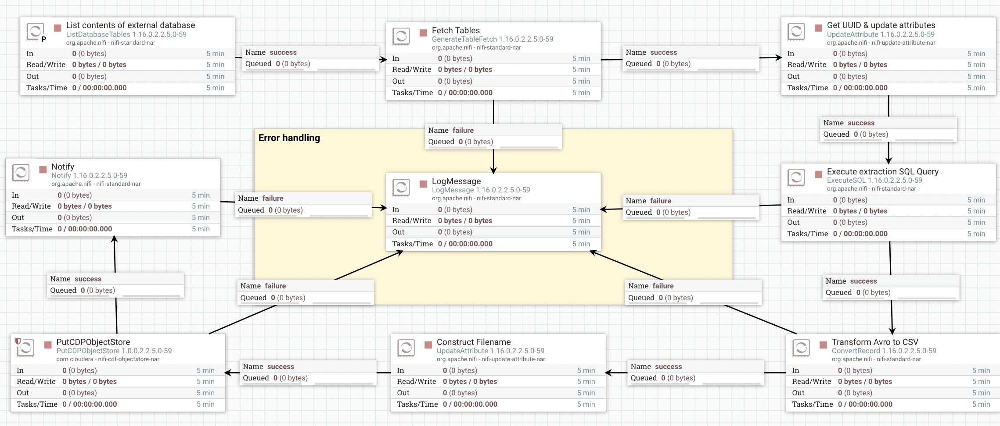

		1. Enable all the controller services shown in the below diagram
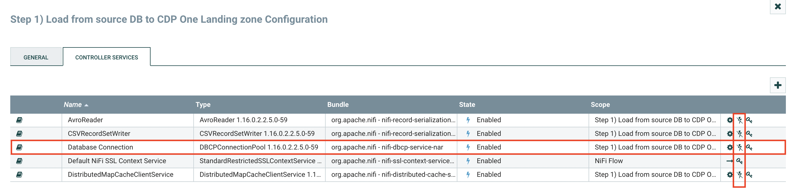        
		2. Validate and Modify the below parameters
			1. update the existing source db_username, db_password, db_hostname, db_port

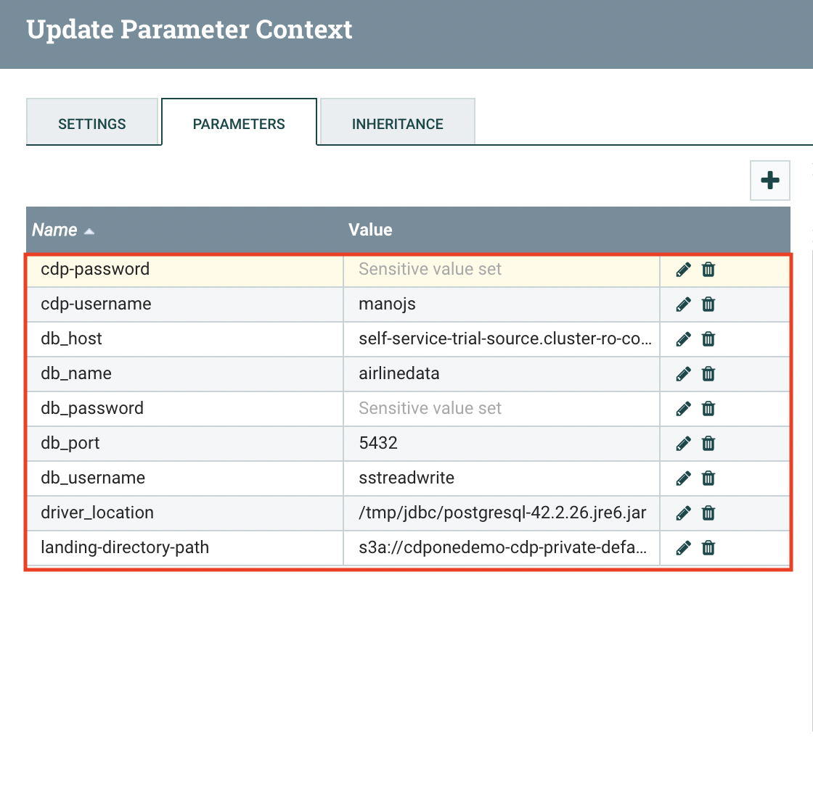           

			2. By using this URL (https://jdbc.postgresql.org/download/postgresql-42.2.26.jre6.jar) to download the postgres jdbc driver
            3. update the AWS S3 bucket with right name - (landing-directory-path)
            4. provide Cloudera cdpone tenant username and password ((cdp-username & cdp-password))

Step 4: Before running the flow, validate the Database connection controller service
    Note: This service will validate the DB connection by using the details from paramater context and DB User should have privileges to read and export the data

    

Step 5: Start the workflow and validate the AWS S3 bucket for the database table data (s3a://cdponedemo-cdp-private-default-3hxxiqv/landing/airlines)

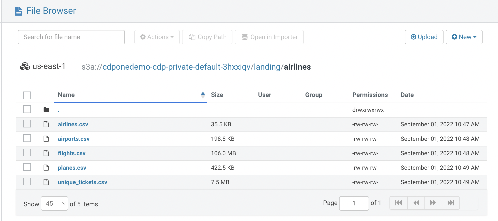

## Part 3:

Configuring the Nifi flow to execute Airline-Ingestion-Workflow-Stage2.

Step 1: From Nifi GUI, click on Add Process Group

Step 2: Then, upload the flow file definition from Nifi Schema Registry
    Note: Select the Airline-Ingestion-Workflow-Stage2 flow with the latest version

    

Step 3: Below workflow connects with AWS s3 to fetch the table data(CSV), create the dynamic schema, convert table data to avro format, convert avro data to orc files by removing the null data, along with schema and create hive database and tables in hive

    Note: But, before starting the flow, we need to modify and enable some parameters and controller services
		1. Enable all the controller services shown in the below diagram

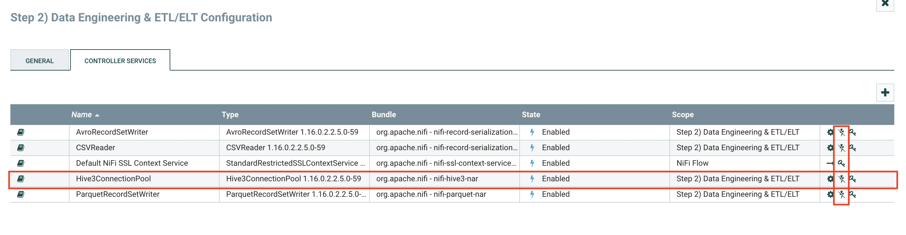               

		2. Validate and Modify the below parameters

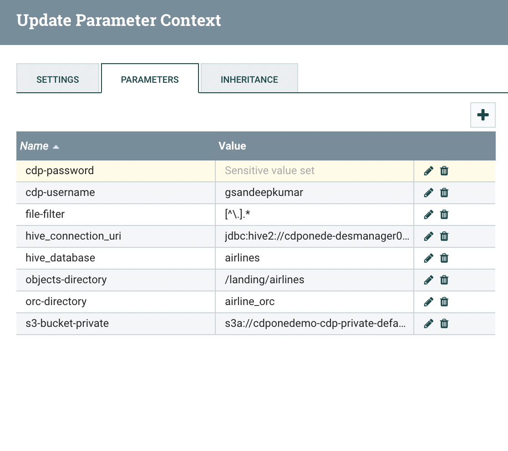        

			1. Update the existing hive connection uri (hive_connection_uri)
			2. provide Cloudera cdpone tenant username and password (cdp-username & cdp-password)
            3. update the AWS S3 bucket with right bucket name(s3-bucket-private)

Step 4: Before running the flow, validate the Hive Database connection controller service
	Note: This service will validate the DB connection by using the hive connection uri from paramater context
Step 5: Start the workflow and validate Hive airlines database

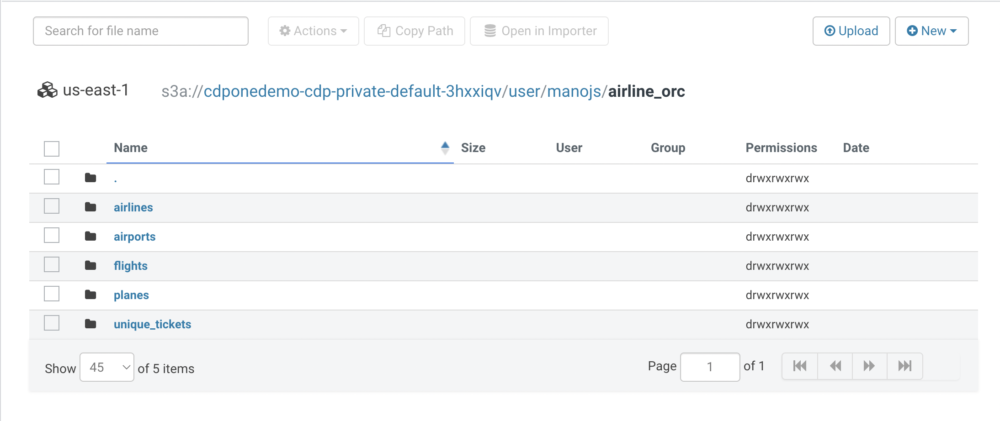

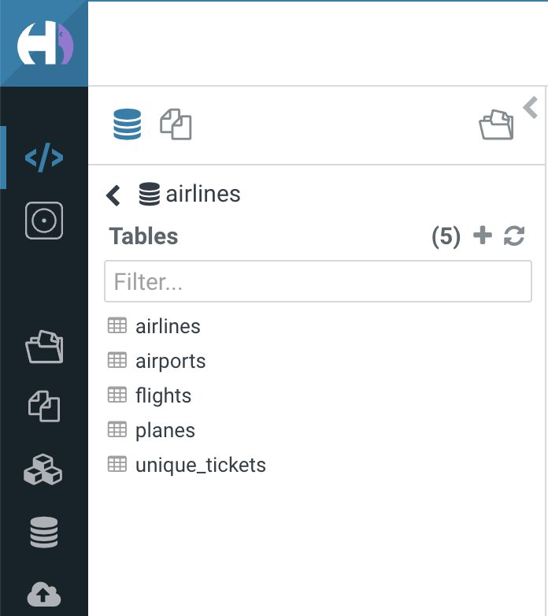

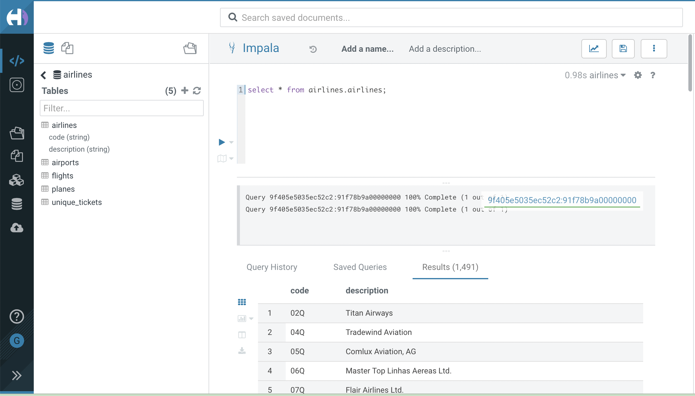
