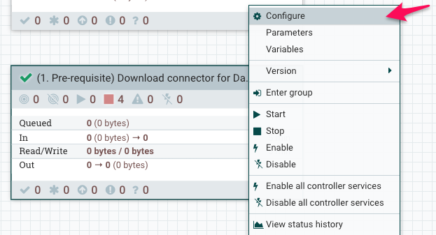

# 01_ingest

In this lab, we will build an end\-to\-end ingestion workflow using Cloudera Data flow.

The primary goal of this workflow is to build an ingestion data pipeline

- The source data exists on a postgresql database. There are 5 datasets that we need to collect and land it into the landing zone of Cloudera Data Platform
    - Flights data
    - Airports data
    - Planes data
    - Airlines data
    - Passenger data
- We connect to the source database and pull all 5 datasets and write the output to ```s3a://\<cdp\-private\-bucket\>/landing/airlines```
- The landing data will be written down in a CSV format

## Lab 1: Data extraction prerequisites \(Install driver\)

1. On your CDP One console, click on ```INGEST``` filter
2. Verify the flows pre\-loaded into your registry
    1. Click on ```Version control data flows```
    2. Three workflows should be preloaded into your registry


3. Now click on ```Build and Monitor data flows```
4. You should see all three processor groups imported for you from the registry


5. We will now run the pre\-requisite workflow to download the connectors to pull data from the external database \(postgresql\)


6. Enable controller services
    1. Right click on the processor group ```\(1. Pre\-requisite\) Download connector for Database source```
    2. Click ```Configure```
    3. Now Click on ```Controller Services``` tab
    4. Then click the ```enable``` icon
    5. Now close the floating window




5. Now, right click on the processor group ```\(1. Pre\-requisite\) Download connector for Database source``` again
6. Click ```Start```

In the background, the connector required to extract data out of our source system \(postgreSQL\) will be downloaded

## Lab 2: Data ingestion to landing zone

In this step, you will continue from lab 1 to extract data from the source system \(postgresql database\) to the CDP One Object store's landing area. We will place the data under ```s3a://<cdp-object-store>/landing/airlines```

1. Navigate back to the ```Build and Monitor data flows``` tile on CDP One console.
2. Before starting the ETL/ELT workflow, you have to enable the ```Controller Settings```
3. Right click on the processor group ```Step 1\) Load from source DB to CDP One Landing zone Configuration```
    1. Click ```Configure```
    2. Now Click on ```Controller Services``` tab
    3. Then click the ```enable``` icon


4. Now, right click on the processor group ```Step 1\) Load from source DB to CDP One Landing zone Configuration``` again
2. Click ```Start```


In this section, we learnt how to extract data from a source system and land the data as files into the CDP Object Store.
