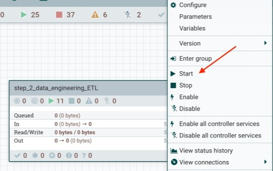

# 02_prepare

In this lab, we will continue the steps from 01\_ingest. We will use the data imported to the landing zone on CDP Object Store to create a dynamic schema, enrich the data and create tables for further analysis, visualization and data science.

This lab demonstrates ETL/ELT workflow to enrich the data to allow users to perform analysis, visualize and create machine learning models.

1. On your CDP One console, click on ```INGEST``` filter
2. Now click on ```Build and Monitor data flows```
3. Before starting the ETL/ELT workflow, you have to enable the "Controller Settings"
4. Right click on the processor group ```Step 2\) Data Engineering & ETL/ELT Configuration```
    1. Click ```Configure```
    2. Now Click on ```Controller Services``` tab
    3. Then click the ```enable``` icon


5. Now, right click on the processor group ```Step 2\) Data Engineering & ETL/ELT Configuration``` again
6. Click ```Start```



Once the ETL/ELT pipeline completes, the data will be loaded into the CDP Data warehouse for further analysis in 03\_analyze
