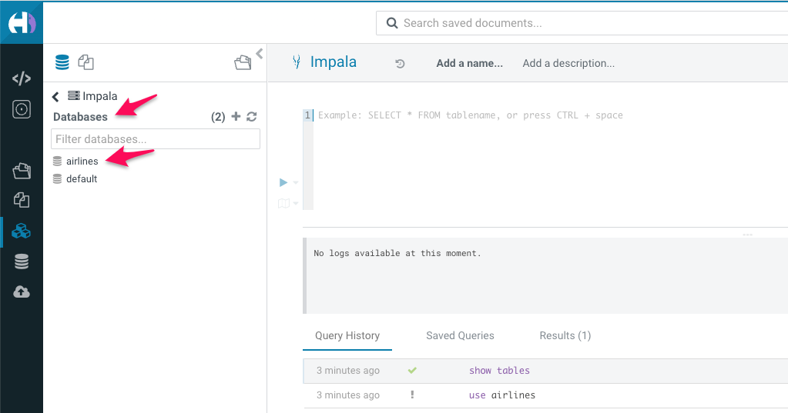
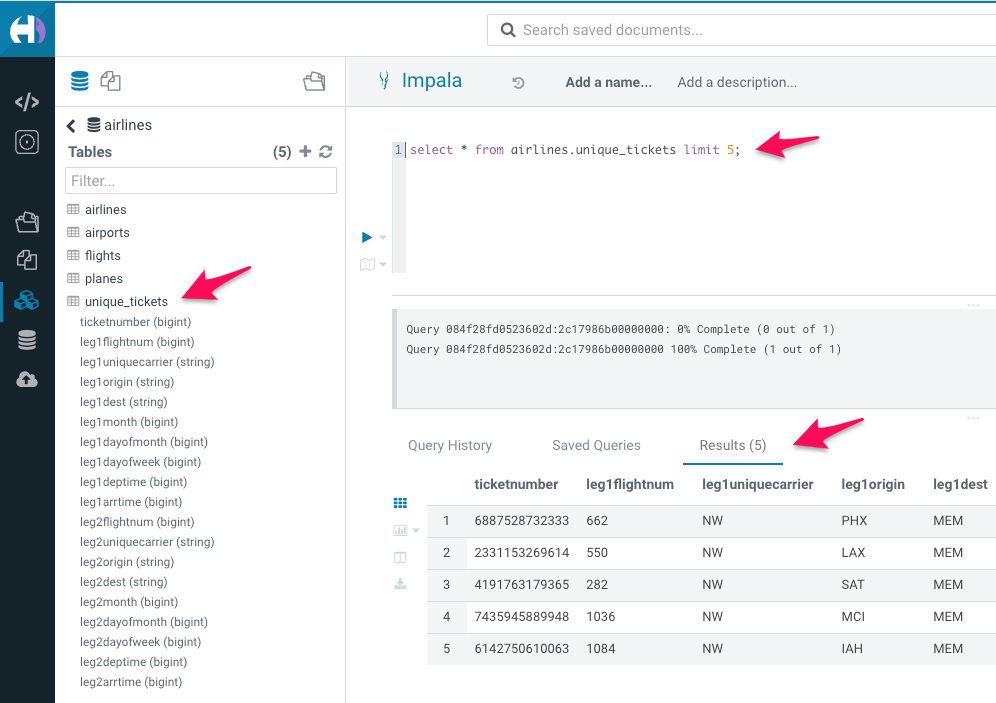

# 03_analyze

In this exercise, we will run interactive analysis of the data we brought in through a data pipeline into the Cloudera Data Warehouse.

## Lab 1: Explore the data ingested

1. On your CDP One console, click on ```ANALYZE``` filter
2. Now, click on ```Query & Upload``` to go to your interactive editor
    1. Note: When given an option to choose the editor to use, select the one with ```dw``` in the name
3. Since the data was just loaded, the metadata needs to be refreshed in the warehouse to run reports on the new datasets
    1. In the query editor, type ```INVALIDATE METADATA;``` and run the query.
4. On the left pane, you will see a catalog of all the `databases` available. Click on "airlines"
5. On the left pane, you will now see a list of all the `tables` ingested through your ETL/ELT pipeline in the 01_ingest & 02_prepare phases



6. You can now click on the table name to explore the schema of the table and run any sample queries to explore the dataset



## Lab 2: Build Business Intelligence Reports

We will now run interactive queries to build business intelligence reports. The business wants to build Passenger Manifest & Layover Reporting dashboard to get actionable insights out of the data.

You can run the below queries on the interactive query editor as above.

**Query 1:**  Query to find all international flights: flights where destination airport country is not the same as origin airport country

```
SELECT DISTINCT
   flightnum,
   uniquecarrier,
   origin,
   dest,
   `month`,
   dayofmonth,
   `dayofweek`
FROM
   `airlines`.flights f,
   `airlines`.airports oa,
   `airlines`.airports da
WHERE
   f.origin = oa.iata
   and f.dest = da.iata
   And oa.country <> da.country
ORDER BY
   `month` ASC,
   dayofmonth ASC;
```

**Query 2:** Query to explore passenger manifest data:  do we have international connecting flights?

```
SELECT
*
FROM
   `airlines`.unique_tickets a,
   `airlines`.flights o,
   `airlines`.flights d,
   `airlines`.airports oa,
   `airlines`.airports da 
WHERE
   a.leg1flightnum = o.flightnum
   AND a.leg1uniquecarrier = o.uniquecarrier
   AND a.leg1origin = o.origin
   AND a.leg1dest = o.dest
   AND a.leg1month = o.month
   AND a.leg1dayofmonth = o.dayofmonth
   AND a.leg1dayofweek = o.`dayofweek`
   AND a.leg2flightnum = d.flightnum
   AND a.leg2month = d.month
   AND a.leg2dayofmonth = d.dayofmonth
   AND a.leg2dayofweek = d.`dayofweek`
   AND d.origin = oa.iata
   AND d.dest = da.iata;
```

**Query 3:** Number of passengers on the airline that has long, planned layovers for an international flight

```
SELECT
   a.leg1uniquecarrier as carrier,
   count(a.leg1uniquecarrier) as passengers
FROM
   `airlines`.unique_tickets a
where
   a.leg2deptime - a.leg1arrtime>90
group by
   a.leg1uniquecarrier;
```

**Query 4:** Number of passengers on airlines that have elongated layovers for an international flight caused by delayed connection

```
SELECT
   a.leg1uniquecarrier as carrier,
   count(a.leg1uniquecarrier) as passengers
FROM
   `airlines`.unique_tickets a,
   `airlines`.flights o,
   `airlines`.flights d
where
       a.leg1flightnum = o.flightnum
   AND a.leg1uniquecarrier = o.uniquecarrier
   AND a.leg1origin = o.origin
   AND a.leg1dest = o.dest
   AND a.leg1month = o.month
   AND a.leg1dayofmonth = o.dayofmonth
   AND a.leg1dayofweek = o.`dayofweek`
   AND a.leg2uniquecarrier = d.uniquecarrier
   AND a.leg2origin = d.origin
group by
   a.leg1uniquecarrier;
```

**Query 5:** Number of passengers on airlines that have elongated layovers for an international flight caused by missed connection

```
SELECT
   a.leg1uniquecarrier as carrier,
   count(a.leg1uniquecarrier) as passengers
FROM
   `airlines`.unique_tickets a,
   `airlines`.flights o,
   `airlines`.flights d
where
       a.leg1flightnum = o.flightnum
    AND a.leg1uniquecarrier = o.uniquecarrier
    AND a.leg1origin = o.origin
    AND a.leg1dest = o.dest
    AND a.leg1month = o.month
    AND a.leg1dayofmonth = o.dayofmonth
    AND a.leg1dayofweek = o.`dayofweek`
group by
   a.leg1uniquecarrier;
```
