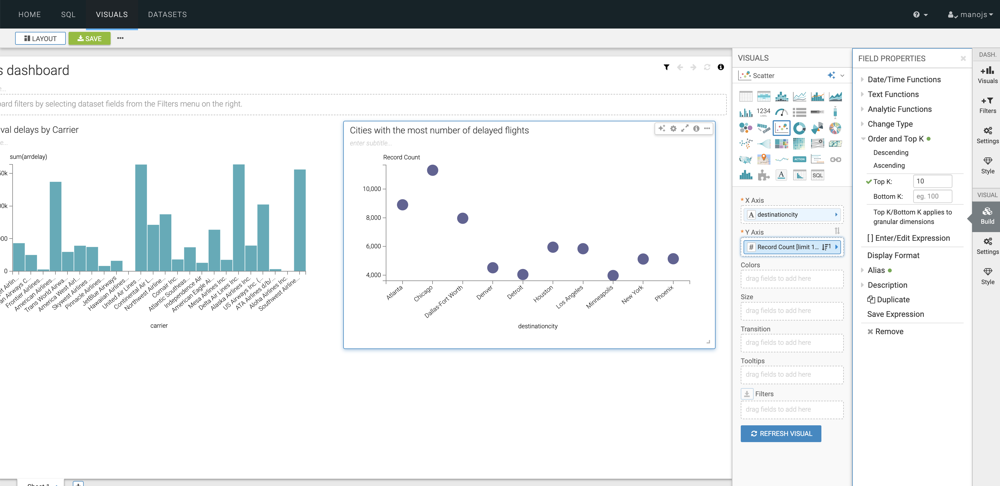
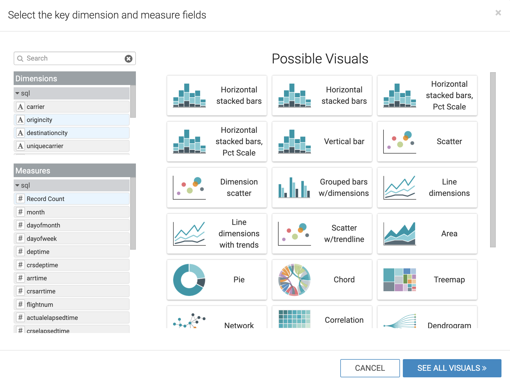

# 04_visualize

# Embedded Data Visualizations

## Lab 1: Enable data visualization:

1. On your CDP One console, click on
2. Now, click on "Build a Data Science Project" to go to your Machine Learning workspace
3. Now create a
4. On the left pane, you will see a tab called

It will take a few minutes for the data application to launch.


---

## Lab 2: Create data connection and datasets to Visualize

1. Collect information for connecting to the Data Warehouse
    1. On the CDP One console, click on the `ALALYZE` filter
    2. Now click on `Third Party Connections` -> `Connect to Impala`
    3. Take a copy of the
2. Continue from where we left Lab 1. Once the Data Application is up and running, click on `HOST` field & the `HTTP PATH` field
3. Fill the form as follows:
    1. `Connection type` as `CDW Impala`
    2. `Connection Name` as `CDW`
    3. Under the `Basic` tab,
        1. Under `Hostname` enter the hostname you collected in the step above
        2. Leave `Port` as the default value of `443`
        3. Enter your CDP username and your password
    4. Under the `Advanced` tab
        1. Choose `Connection mode` as `HTTP`
        2. Enter the `HTTP Path` information you collected above
        3. Leave the default value of `Socket type` as `SSL` & `Authentication Mode` as `Plain`
    5. Click `Test` and then `Connect`


## Lab 3: Create a dataset

In this lab, we will create a dataset that contains a correlation across the various datasets we have ingested and prepare for creating visualizations.

1. Once Connection is established using the instructions from Lab 2, click on the name of the connection under `All Connections`
2. Now click `New Dataset`
3. `Dataset title` as `airlines-master`
4. `Data Source` as `From SQL`
5. Enter the below SQL query into the field:

```
select B.description as 'carrier', C.city as 'origincity', D.city 'destinationcity', A.* ,
CAST( CONCAT(CAST( `year` AS STRING) , '-',  CAST( `month` AS STRING)  ,  '-',  CAST( `dayofmonth` AS STRING) )
          AS DATE FORMAT 'yyyy-mm-dd' ) as flightdate
          from airlines.flights A
                INNER JOIN airlines.airlines B ON A.uniquecarrier = B.code
                INNER JOIN airlines.airports C ON A.origin = C.iata
                INNER JOIN airlines.airports D ON A.dest = D.iata
```

6. Click `Create`

## Lab 4: Create a dashboard

In this lab, we will create a sample dashboard to visualize the reports for a business user.

1. Click on the `dataset` we created in Lab 3 and then click `New Dashboard` icon.


2. We will now create 3 reports & charts in this dashboard
    1. Total arrival delays by Carrier
    2. Cities with the most number of delayed flights \(Top 10\)
    3. Correlate delays with origin & destination city pairs

### Total arrival delays by Carrier

1. Enter a the tile for the dashboard as `Airlines dashboard`
2. Click `Visuals`, then `New Visual`


1. Click `Grouped Bars` as the chart type
2. From the `Dimensions` shelf, drag the `carrier` field into the `X Axis` field
3. From the `Measures` shelf, drag the `arrdelay` field into the `Y Axis` field
4. Enter the title for this chart as `Total arrival delays by Carrier`


### Cities with the most number of delayed flights \(Top 10\)

We will create a scatter chart to identify the cities that have the most number of delayed flights

1. Click `Visuals`, then `New Visual`
2. Click `Scatter` as the chart type
3. Enter the name of the chart as `Cities with the most number of delayed flights (Top 10)`
4. From the `Dimensions` shelf, drag the `destinationcity` field into the `X Axis` field
5. From the `Measures` shelf, drag the `Record Count` field into the `Y Axis` field & double click on the field you just brought in.
6. We now want to only show the top 10 records.
    1. Under `Field Properties` , go to `Order` and `Top K` field, then to Top K
    2. Enter `10` as the value and click `Refresh Visual`



### Correlate delays with origin & destination city pairs

For this use\-case, we will let Cloudera Data Visualization recommend a chart type for us.

1. Click `Visuals`, then `New Visual`
2. Now click on `Explore Visuals`


1. In the pop-up window, choose `origincity` and `destinationcity` on the `Dimensions` shelf. `Record Count` on the `Measures` shelf
2. The `Possible Visuals` pane will show you a list of recommended visuals.
3. You can explore the various charts and then choose `Correlation Heatmap`
4. Name your chart as `Correlate delays with origin & destination city pairs`



7. You can change the color of correlation map by clicking on the `Explore Options` icon on top of the chart and then `Colors`, then choose a format you prefer


As a nextstep, you can try creating a visual application based on the dashboard we just built and showcase how a business user dashboard could look like. The documentation is [here](https://docs.cloudera.com/data-visualization/7/howto-apps/topics/viz-create-app.html)
