# 06_secure

# NOTE: THIS SECTION MIGHT BE REMOVED. WAITING FOR FURTHER CONFIRMATION.

## Lab 1: Configure SQL permissions in ranger

1. On your CDP One console, click on Security and Manage Policies with Ranger

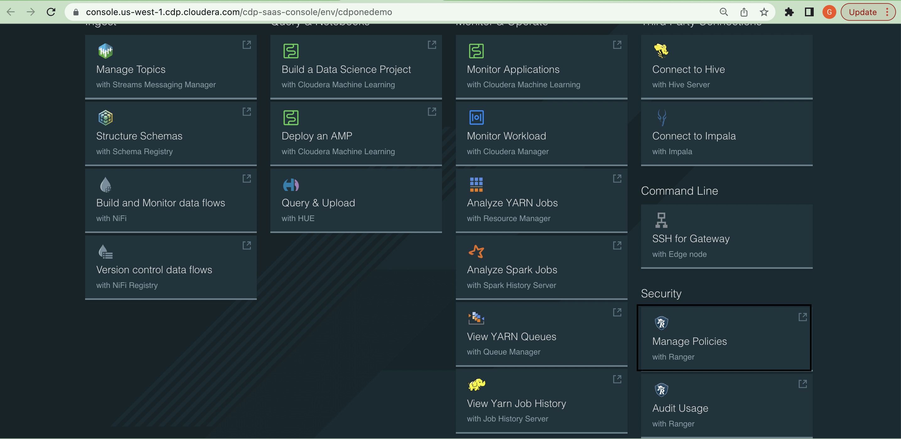

2. Now, click on "hadoop SQL" to go to policies page

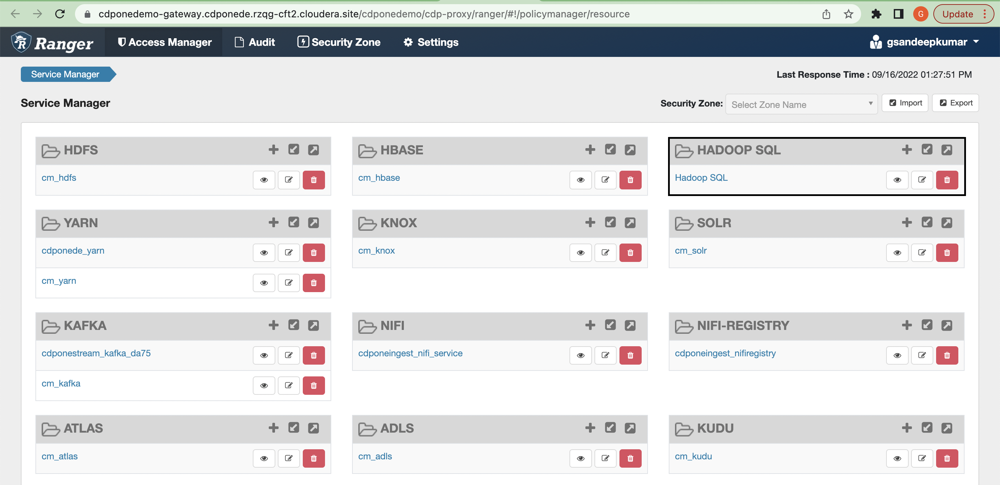

3. Now, click on "all - database, table, column" policy name and use edit action button

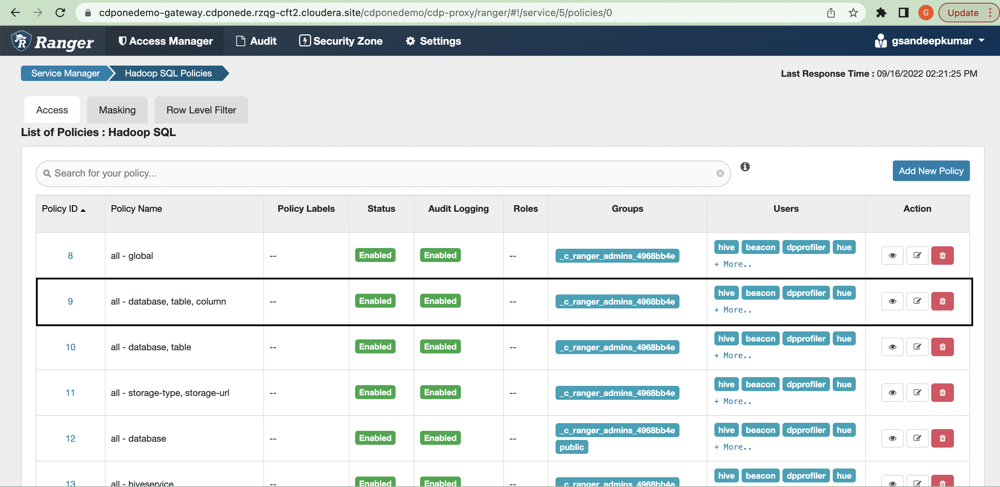

4. In the Allow Conditions section, provide the required user which will be accessing the hive databases and update the right permission (select, update, create, delete)

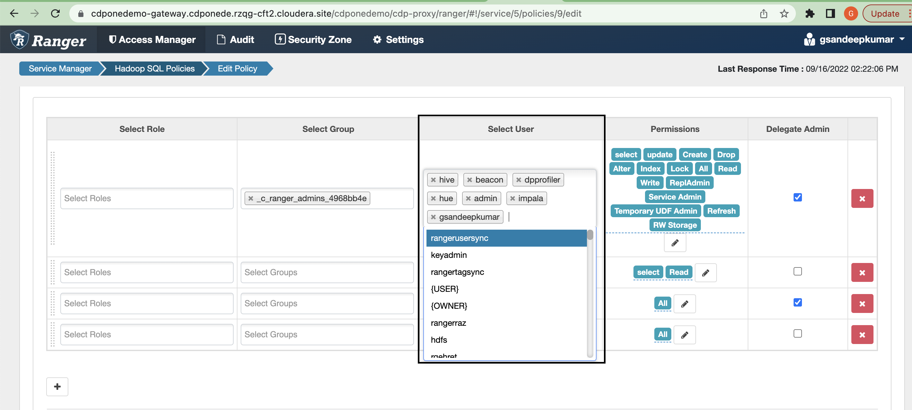

It will take a few minutes for the data application to launch.

## Lab 2: Configure Column level masking

1. On your CDP One console, click on Security and Manage Policies with Ranger

2. Now, click on "hadoop SQL" to go to policies page

3. Now, click on "Masking and Add New Policy" to create a column level masking policy

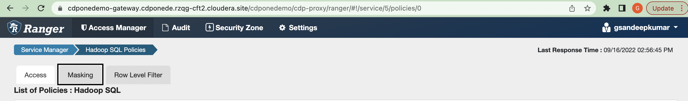

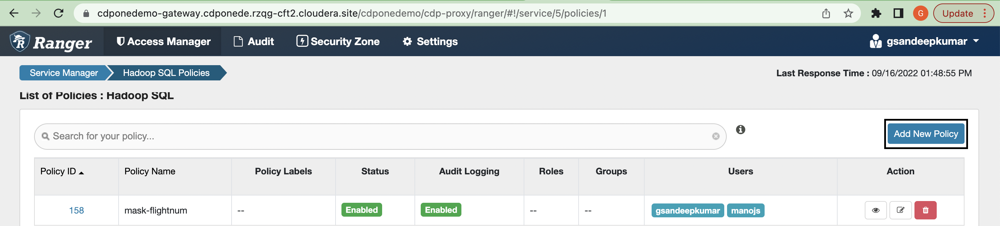

4. Add a New Policy name, hive database(Ex: airlines), hive table(ex: unique_tickets), hive column (ex: leg1flightnum), and add a mask condition by selecting user and access types.

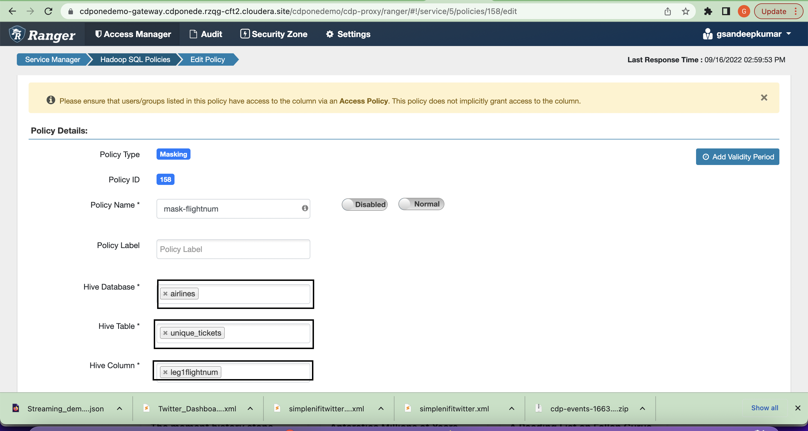

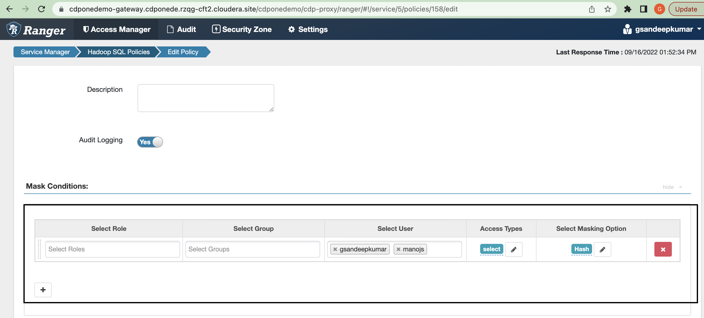

It will take a few minutes for the data application to launch.

## Lab 3: Configure row level filter

1. On your CDP One console, click on Security and Manage Policies with Ranger

2. Now, click on "hadoop SQL" to go to policies page

3. Now, click on "Row level Filter and Add New Policy" to create a Row level filter policy

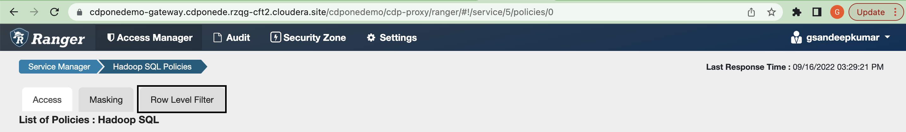

4. Add a New Policy name, hive database(Ex: airlines), hive table(ex: unique_tickets), and add a row filter condition by selecting user and access types.

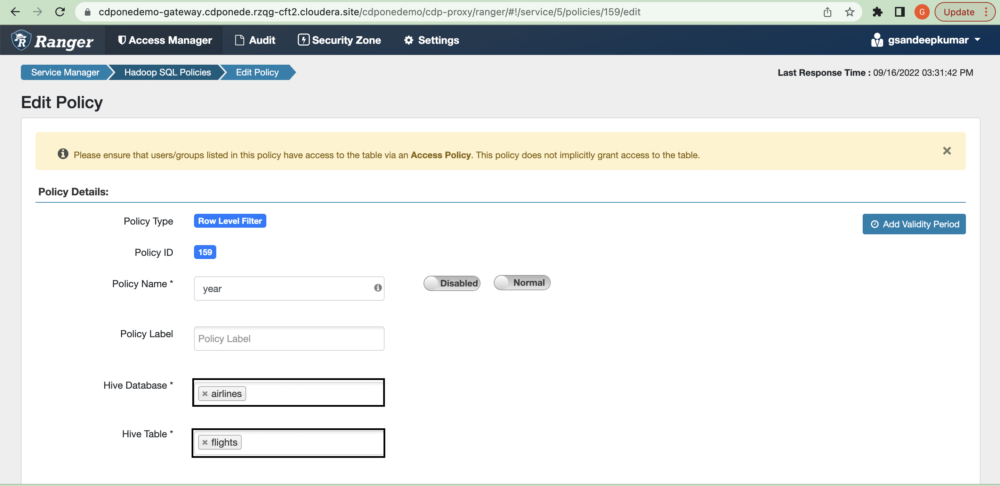

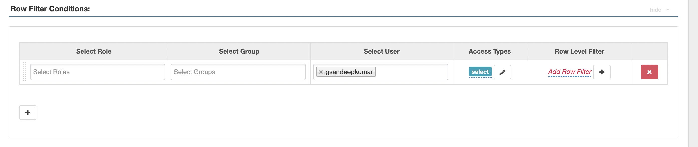

It will take a few minutes for the data application to launch.
