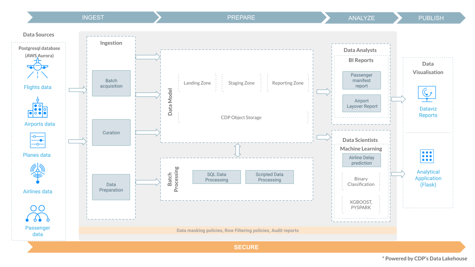

# CDP One - Data Lakehouse - Self Service Trial - Instructions

CDP One is an all\-in\-one data lakehouse software\-as\-a\-service \(SaaS\) offering that enables fast and easy self\-service analytics and exploratory data science on any type of data. A simple yet powerful cloud service, CDP One has built\-in enterprise security and machine learning \(ML\) that requires zero cloud, security, or monitoring operations staff for lower TCO and reduced risk.

Designed to make both data practitioners and expert developers more productive, CDP One helps you achieve faster time to business insights to drive innovation and stay ahead of the competition.

CDP One provides you with dedicated, private, and secure CDP environments, so you can focus on building your data applications and not on setting up and maintaining your infrastructure.

This use\-case aims at providing a high\-level overview of how to use the Cloudera Data Platform CDP One service to quickly ingest data from external sources, explore raw data, create curated versions of the data for simple reporting and dashboarding, and then run a machine learning prediction use\-case. It highlights the ease of use and automation capabilities that help ensure business objectives are met.

A real\-life business narrative enables you to follow and understand how one can build a pipeline based on the data lakehouse framework on CDP One. This is a sample use\-case and real life use\-cases follow a similar pattern.

For the use\-case today, we will use the airlines dataset.

### Use\-case reference architecture:

**Data Model:**

With the above use\-case, we will go through each phase of building a data lakehouse which includes the below:

- Ingest
- Prepare
- Analyze
- Visualize
- Predict
- Secure

